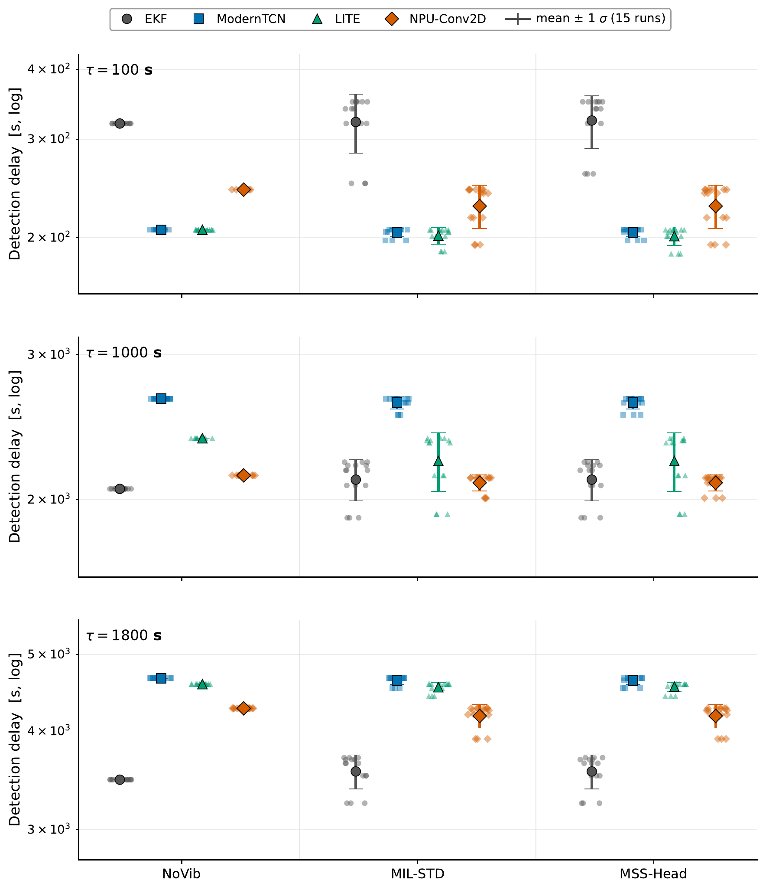

# ISC Detection under Shipboard Vibration

The paper [**"Internal Short-Circuit Detection in Lithium-Ion Batteries under Shipboard Vibration: A Unified Model-Based and Data-Driven Benchmark with NPU-Accelerated Inference"**][paper]'s experimentation code.

## Overview

Marine battery systems are exposed to MIL-STD-810H Method 528.1 mechanical
vibration (4–33 Hz) continuously for 24 h. Vibration modulates the cell contact
resistance, injecting noise into the terminal voltage. Classical internal
short-circuit (ISC) detectors are validated only in vibration-free laboratory
conditions — this work benchmarks a **model-based** detector against three
**data-driven** detectors (one of which is **NPU-accelerated**) once that
vibration noise is present.

**Input** — a 10 s sliding window resampled to 100 Hz (1000 samples), with 1 or 2
channels depending on the method:

| Signal           | Symbol | Unit | Used by                          |
| ---------------- |:------:|:----:| -------------------------------- |
| Terminal voltage | $V$    | V    | EKF, ModernTCN, LITE, NPU-Conv2D |
| Cell temperature | $T$    | K    | ModernTCN, LITE, NPU-Conv2D      |

**Output** — a per-window binary label (Normal / ISC), aggregated to a run-level
**detection delay** and a **PASS/FAIL** verdict against a resistance deadline
$R_\text{deadline}$.

> _Data source: generated in-house with MATLAB/Simulink + Simscape Battery (no public dataset). Trained weights and `.mat`/`.npz`/`.json` outputs are not tracked — regenerate via the pipeline below._

## Repository Structure

```
ISC-Detection_under_Shipboard/
├── ai/                          # Python AI pipeline
│   ├── config.py                # Central experiment configuration
│   ├── data/                    # load → preprocess (100 Hz) → window → split
│   ├── models/                  # ekf, modern_tcn, lite, npu_conv2d
│   ├── training/                # train_supervised, evaluate, evaluate_ekf
│   ├── scripts/                 # pipeline / training / evaluation entry points
│   ├── export/                  # ONNX export, INT8 quantization, TFLite (STM32Cube.AI)
│   └── measure_macs.py          # MACs / parameter accounting
├── scripts/                     # MATLAB / Simulink simulation
│   ├── build_simscape_model.m   # Battery + vibration-coupled resistance + thermal
│   ├── generate_vibration.m     # Vibration acceleration synthesis (MIL-STD + ship motion)
│   ├── run_simulation.m         # Main scenario × k_R sweep
│   ├── run_tau_sweep.m          # ISC time-constant (τ) sweep — training data
│   └── run_eval_tau.m           # Evaluation-only sweep on unseen τ
├── models/                      # Simulink models (ShipBattery_Module/Model.slx)
└── figs/                        # Result figures
```

## Requirements

- **MATLAB R2022b** with Simscape Battery — model and simulation
- **[MSS – Marine Systems Simulator](https://github.com/cybergalactic/MSS)** — external
  toolbox used by `generate_vibration.m` for ship-motion scenarios
- **Python** with PyTorch — training and ONNX export
- **ONNX Runtime** and **STM32Cube.AI / `stedgeai`** — embedded deployment

## Usage

The full pipeline runs in five stages, from physical simulation to embedded export.

### 1. Simulation (MATLAB) — produces `data/*.mat`

```matlab
build_simscape_model      % build the Simscape battery model
generate_vibration        % synthesize vibration acceleration (MIL-STD + ship motion)
run_simulation            % scenario × k_R sweep
run_tau_sweep             % ISC τ sweep for training data
run_eval_tau              % evaluation-only sweep on unseen τ
```

### 2. Data pipeline (Python)

```bash
python -m ai.scripts.run_pipeline          # load → preprocess → window → split (sanity check)
```

### 3. Training

```bash
python -m ai.scripts.run_training          # ModernTCN, LITE
python -m ai.scripts.run_train_npu_conv2d  # NPU-Conv2D
python -m ai.scripts.run_qat               # quantization-aware fine-tuning (optional)
```

### 4. Evaluation

```bash
python -m ai.scripts.run_multi_deadline    # EKF vs AI: detection delay + PASS/FAIL per deadline
python -m ai.scripts.run_per_kr_f1         # window-level F1 vs vibration coupling k_R
```

### 5. Embedded export (STM32N6)

```bash
python -m ai.export.export_onnx            # PyTorch → ONNX
python -m ai.export.quantize_onnx          # ONNX → INT8
python -m ai.export.convert_tflite         # → TFLite for STM32Cube.AI
```

## Model Architectures

| Model                     | Params | Inputs | Description                                                                                                         |
| ------------------------- |:------:|:------:| ------------------------------------------------------------------------------------------------------------------- |
| **EKF + 3σ** (baseline) | — | $V$ | 1RC equivalent-circuit model; ΔSOC-mismatch residual vs per-scenario $3\sigma$ threshold. |
| [**ModernTCN**](https://github.com/luodhhh/ModernTCN) (ICLR 2024) | 27,873 | $V,T$ | Lightweight large-kernel TCN. |
| [**LITE**](https://github.com/MSD-IRIMAS/LITE) (IEEE DSAA 2023) | 16,217 | $V,T$ | Light Inception with multi-scale + depthwise-separable convs. |
| **NPU-Conv2D** | 50,849 | $V,T$ | Compact Conv2D mapped to the STM32N6 Neural-ART NPU. |

## Vibration Noise Model

Vibration adds a contact-resistance term $\Delta R(t)$ to the cell, proportional
to the acceleration magnitude, so it appears as noise on the terminal voltage:

$$\Delta R(t) = k_R \, |a(t)|, \qquad V_\text{terminal}(t) = \text{OCV}(\text{SOC}) - I(t)\,\big[R_0 + R_1 + \Delta R(t)\big]$$

The coupling gain $k_R$ (swept $0.05$–$1.0$ mΩ/g) sets the noise strength. The ISC
fault is a gradual resistance decay $R_\text{ISC}(t)$ from 500 Ω to 5 Ω with time
constant $\tau$ — trained on $\tau\in\{50, 300, 3600\}$ s and tested on **unseen**
$\tau\in\{100, 1000, 1800\}$ s.

## Results

Benchmark over 180 runs (4 deadlines × 3 unseen $\tau$ × 3 scenarios × 5 $k_R$).

<p align="center">
  
</p>

_Detection delay across ISC speed $\tau$ (rows) and vibration scenario (columns); markers show mean ± 1σ over 15 runs._ The EKF is fastest on slow ISC faults but its detection-delay variance **inflates sharply under vibration** and it raises 60 pre-onset false alarms. The data-driven detectors are slower on slow faults yet remain **tightly clustered across every vibration scenario with zero false alarms** — NPU-Conv2D achieves the best deadline-PASS while running on the NPU.

> [!NOTE]
> This repository contains only the experimentation code. For the full methodology, experimental design, and detailed results, please refer to the [paper].

## License

Released under the [MIT License](LICENSE).

<!-- TODO: replace # with the published paper URL; the title and the NOTE above both link here -->

[paper]: #
